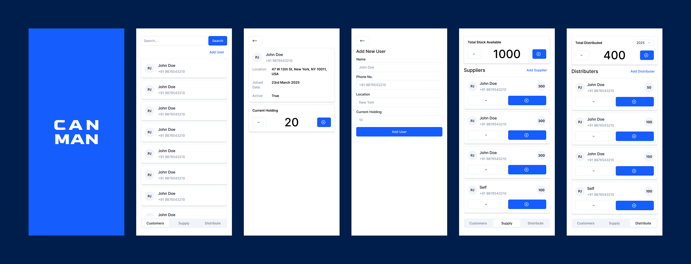

# CANMAN – Water Can Delivery Tracker 💧

CANMAN is a lightweight and efficient mobile-first app that helps manage and track the supply and distribution of water cans between suppliers, distributors, and customers. Built with simplicity and clarity in mind, it makes inventory tracking hassle-free.

---

## 🚀 Features

- 🔍 **User Management**

  - Add, search, and view users (suppliers, distributors, customers)
  - View user profiles with joined date, location, and current holding

- 📦 **Stock Monitoring**

  - Real-time overview of total stock available
  - Adjustable can holdings and balances

- 🔄 **Supply & Distribution Tracking**

  - Track incoming supply and outgoing distributions
  - Monitor total distributed volume by year
  - Allocate cans per user with simple + / - controls

- 📱 **Mobile-First UI**
  - Responsive and clean design with tab-based navigation (Customers, Supply, Distribute)

---

## 🛠 Tech Stack

- **Frontend:** Flutter
- **Backend:** Firebase Firestore

---

## 📈 Roadmap

- [x] MVP UI Design
- [ ] Cloud Firestore Integration
- [ ] Push Notifications for Refill Reminders
- [ ] Monthly Report Generation
- [ ] Offline Sync

---

## 📄 License

This project is licensed under the MIT License.

---

## 📬 Contact

For support, questions, or collaborations:
**Email:** dev.anandureghu@example.com
